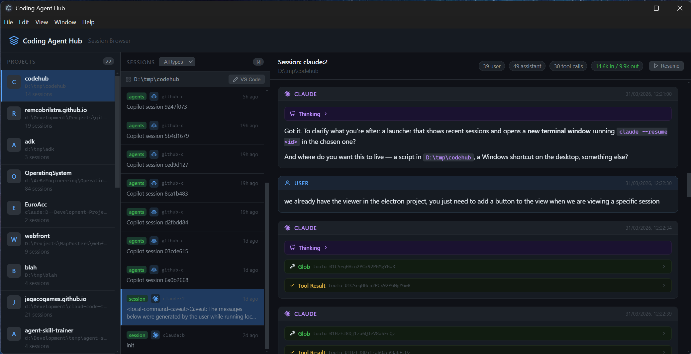

# Coding Agent Hub


Coding Agent Hub is an Electron + TypeScript desktop app giving you some insights into the session you have had with different agents. It currently supports GitHub Copilot, Claude Code, and Codex CLI.
The app allows you to simply open project folders in vscode or resume your session

**warning** this is very much a experimenal app, it will have bugs, mostly sharing because I found it quite useful others may feel the same.

## Some of the features

- Overview of session per project 
- Easily resume sessions
- Quick option to open a project in vscode
- Get an overview of token consumption during the session

## Platform support
- Windows only

## known issues
- sessions with sub-agents are rendered but not very nicely
- the markdown rendering needs to be cleaned up
- for Github copilot draft session (ie. nothing was ever submitted) show up in session list
- for Github copilot we currently only show IDE sessions no CLI, as i havent found a way to match those logs to a specific folder


## whats next

- mac support
- Gemini cli
- what else ?

## Quick start

```bash
npm install
npm run build
npm start
```
